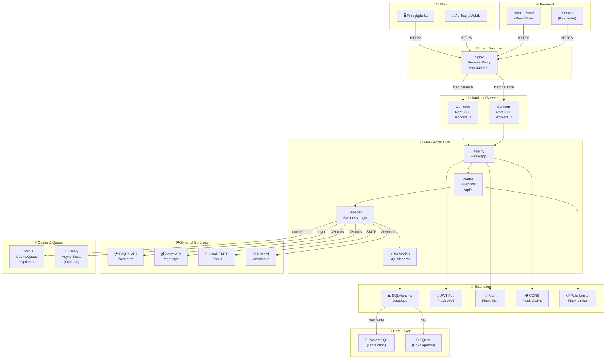
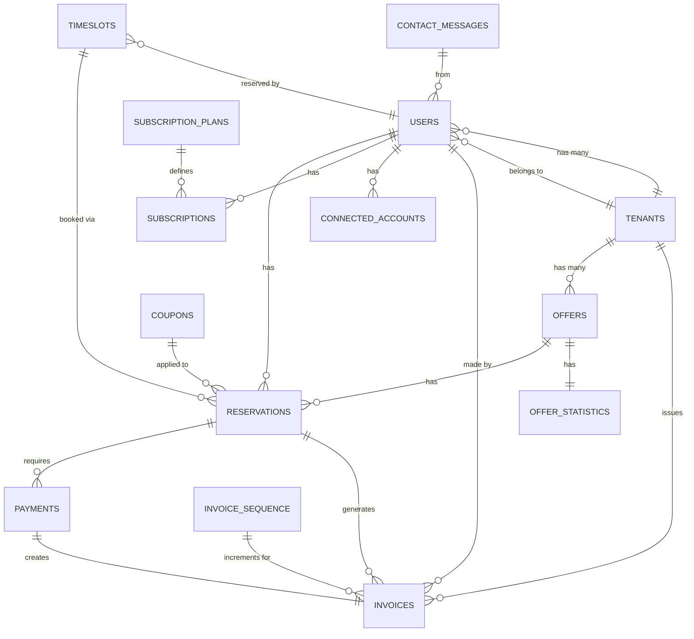
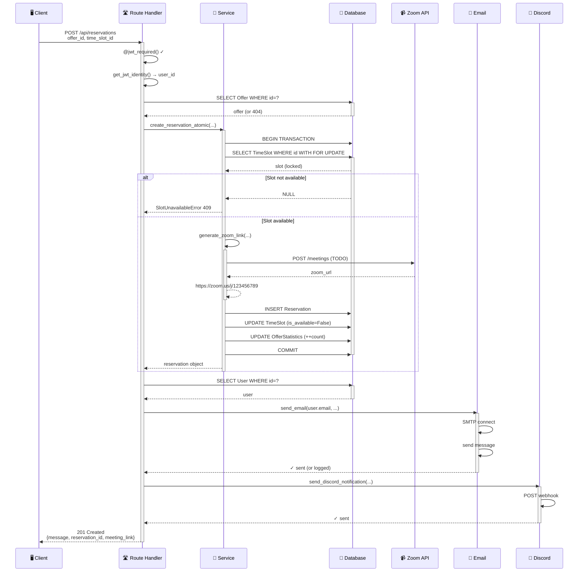
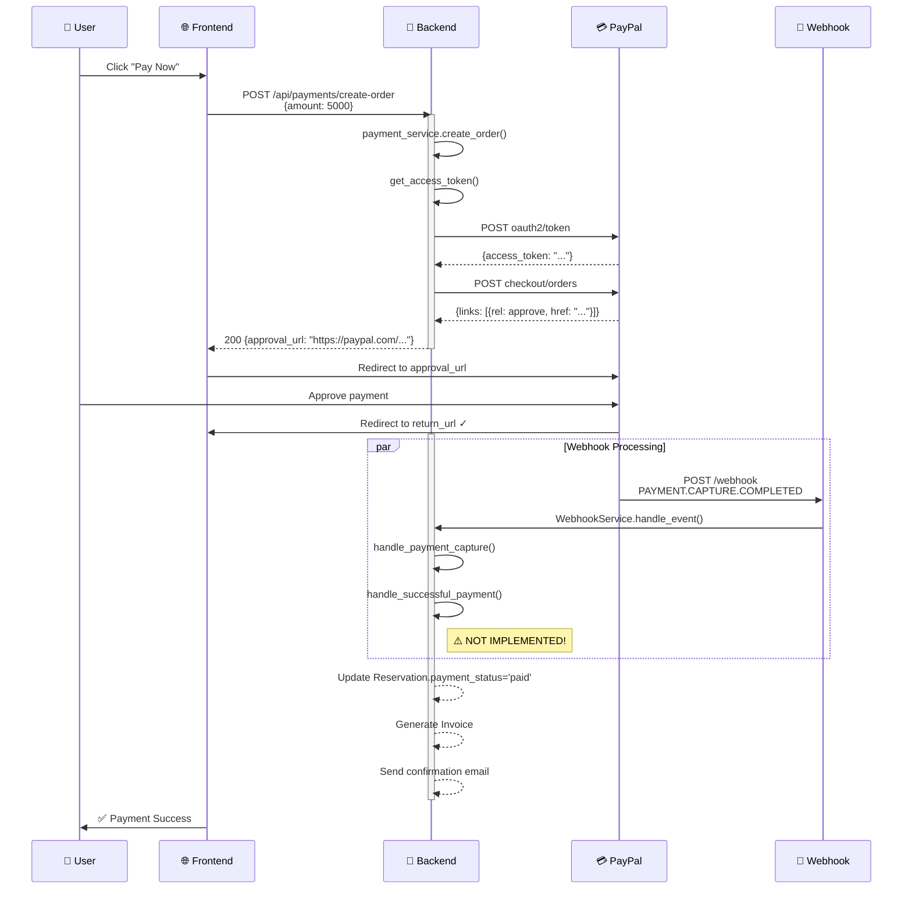
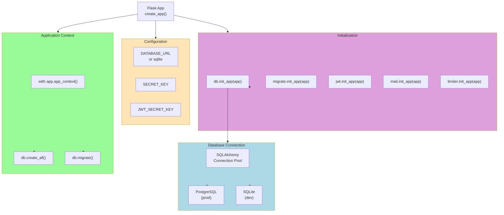

# 🎨 DIAGRAMY ARCHITEKTURY

## 1. System Architecture Diagram

---

## 2. Database Entity Relationship Diagram

---

## 3. API Routes Hierarchy

```mermaid
graph TD
    API["/api<br/>Root"]
    
    API --> Auth["/api/auth<br/>Authentication"]
    API --> Offers["/api/offers<br/>Offers Management"]
    API --> Reservations["/api/reservations<br/>Reservations"]
    API --> Slots["/api/slots<br/>Time Slots"]
    API --> User["/api/user<br/>User Management"]
    API --> Contact["/api/contact<br/>Contact Form"]
    API --> Payments["/api/payments<br/>Payments"]
    
    Auth -->|POST| Register["register<br/>Create new user"]
    Auth -->|POST| Login["login<br/>Get JWT token"]
    Auth -->|GET| Me["me<br/>Current user info"]
    Auth -->|POST| Logout["logout<br/>Invalidate session"]
    Auth -->|GET| Verify["verify/token<br/>Email verification"]
    Auth -->|POST| ResetPwd["reset-password<br/>Password recovery"]
    
    Offers -->|GET| OffersList["/ <br/>All offers"]
    Offers -->|GET| OfferDetail["/offer_id<br/>Offer details"]
    Offers -->|POST| OfferCreate["/Create new"]
    Offers -->|PUT| OfferUpdate["/:id Update"]
    Offers -->|PATCH| OfferToggle["/:id/toggle"]
    Offers -->|DELETE| OfferDelete["/:id Delete"]
    Offers -->|POST| GenOffer["/generate-optimal<br/>AI bundle"]
    Offers -->|GET| Insights["/insights<br/>Market trends"]
    Offers -->|GET| Recommend["/recommendations<br/>For user"]
    
    Reservations -->|POST| ResCreate["/ Create"]
    Reservations -->|GET| ResAll["/ All"]
    Reservations -->|GET| ResUser["/user/:id User"]
    Reservations -->|PATCH| ResStatus["/:id/status"]
    Reservations -->|PATCH| ResCancel["/:id/cancel"]
    
    Slots -->|GET| SlotList["/ Available"]
    Slots -->|POST| SlotCreate["/Create"]
    Slots -->|DELETE| SlotDelete["/:id Delete"]
    Slots -->|POST| SlotBulk["/bulk Batch"]
    
    User -->|GET| Profile["/profile"]
    User -->|PUT| ProfileUpdate["/profile Update"]
    User -->|GET| MyRes["/reservations"]
    User -->|GET| AllUsers["/all Admin"]
    
    Contact -->|POST| ContactSend["/ Send message"]
    Contact -->|GET| ContactList["/List all"]
    Contact -->|PATCH| ContactStatus["/:id/status"]
    
    Payments -->|POST| PaymentCreate["/create-order"]
    Payments -->|GET| Invoices["/invoices"]
    
    classDef public fill:#90EE90
    classDef protected fill:#FFB6C1
    classDef admin fill:#FF6347
    classDef external fill:#87CEEB
    
    class OffersList,OfferDetail,ResUser,Insights,Recommend,Slot* public
    class Me,Profile,MyRes,ContactSend protected
    class Register,Login,Logout,Auth,OfferCreate,OfferUpdate,Offerings,ResCreate,ResAll,ProfileUpdate,AllUsers,ContactList admin
    class PaymentCreate,Invoices external
```

---

## 4. Request Flow - Create Reservation

---

## 5. Authentication & Authorization Flow

```mermaid
graph LR
    subgraph Auth["🔐 Authentication"]
        Register["1. Register<br/>User"]
        VerifyEmail["2. Verify Email<br/>(Skipped)"]
        Login["3. Login<br/>Email + Password"]
        GetToken["4. Get JWT Token<br/>24h expiry"]
    end
    
    subgraph Protected["🛡️ Protected Routes"]
        Check["Check Token<br/>@jwt_required()"]
        Validate["Validate Signature"]
        Extract["Extract user_id"]
        Route["Route Handler"]
    end
    
    subgraph Storage["💾 Token Storage"]
        LocalStorage["LocalStorage<br/>(Frontend)"]
        Header["Authorization Header<br/>Bearer token"]
    end
    
    Register -->|is_verified=True| VerifyEmail
    VerifyEmail -->|Auto-approved| Login
    Login -->|valid credentials| GetToken
    GetToken -->|eyJ0e...| LocalStorage
    LocalStorage -->|every request| Header
    Header -->|Bearer eyJ...| Check
    Check -->|valid| Validate
    Validate -->|signature ok| Extract
    Extract -->|user_id| Route
    Route -->|business logic| Protected
    
    style Auth fill:#90EE90
    style Protected fill:#FFB6C1
    style Storage fill:#87CEEB
```

---

## 6. Payment Flow (PayPal Integration)

---

## 7. Service Dependencies

```mermaid
graph TB
    subgraph API["API Routes"]
        auth["auth.py"]
        offers["offers.py"]
        reservations["reservations.py"]
        slots["slots.py"]
        user["user.py"]
        contact["contact.py"]
        payment["payment.py"]
    end
    
    subgraph Services["Business Services"]
        res_svc["reservation_service<br/>create_reservation_atomic"]
        pay_svc["payment_service<br/>create_order"]
        email_svc["email.py<br/>send_email"]
        zoom_svc["zoom.py<br/>generate_zoom_link"]
        discord_svc["discord.py<br/>send_discord"]
        analysis_svc["analysis_service<br/>identify_optimal"]
        rec_svc["recommender_service<br/>get_recommendations"]
        invoice_svc["invoice_service<br/>generate_invoice"]
        webhook_svc["webhook_service<br/>handle_event"]
    end
    
    subgraph Models["Data Layer"]
        user_model["User"]
        offer_model["Offer"]
        res_model["Reservation"]
        slot_model["TimeSlot"]
        stats_model["OfferStatistics"]
        payment_model["Payment"]
        invoice_model["Invoice"]
    end
    
    subgraph External["🌍 External"]
        paypal["PayPal API"]
        zoom["Zoom API"]
        gmail["Gmail SMTP"]
        discord_api["Discord API"]
    end
    
    auth --> email_svc
    offers --> analysis_svc
    offers --> rec_svc
    reservations --> res_svc
    reservations --> email_svc
    reservations --> discord_svc
    payment --> pay_svc
    payment --> invoice_svc
    
    res_svc --> zoom_svc
    res_svc --> stats_model
    res_svc --> slot_model
    
    pay_svc --> paypal
    
    email_svc --> gmail
    zoom_svc --> zoom
    discord_svc --> discord_api
    
    res_svc --> res_model
    res_svc --> user_model
    res_svc --> offer_model
    
    analysis_svc --> offer_model
    analysis_svc --> res_model
    rec_svc --> res_model
    rec_svc --> offer_model
    
    invoice_svc --> payment_model
    invoice_svc --> invoice_model
    
    webhook_svc --> payment_model
```

---

## 8. Database Connection & Session Management

---

## 9. Rate Limiting & Request Flow

```mermaid
graph LR
    Request["📥 Incoming Request"]
    
    subgraph RateLimit["Rate Limiter Check"]
        IP["Get Client IP"]
        Check["Check Rate Limit<br/>100 per minute"]
        Allow{"Within Limit?"}
    end
    
    subgraph Auth["Authentication"]
        JWT["Parse JWT Token"]
        Verify["Verify Signature"]
        Extract["Extract Payload"]
    end
    
    subgraph Validation["Validation"]
        Schema["Validate Schema<br/>(TODO)"]
        Business["Business Rules"]
    end
    
    subgraph Handler["Route Handler"]
        Logic["Business Logic"]
        Db["Database Query"]
        External["External API"]
    end
    
    subgraph Response["Response"]
        Serialize["Serialize Data"]
        Status["HTTP Status"]
        Send["Send Response"]
    end
    
    subgraph Error["Error Handling"]
        Catch["Catch Exception"]
        Log["Log Error"]
        ClientErr["Return Error Response"]
    end
    
    Request --> RateLimit
    RateLimit --> IP
    IP --> Check
    Check --> Allow
    
    Allow -->|Yes| Auth
    Allow -->|No| Response
    
    Auth --> JWT
    JWT --> Verify
    Verify -->|Valid| Extract
    Extract --> Validation
    
    Verify -->|Invalid| Error
    
    Validation --> Schema
    Schema --> Business
    Business --> Handler
    
    Handler --> Logic
    Logic --> Db
    Db --> External
    External --> Response
    
    Handler -.->|Error| Error
    
    Error --> Catch
    Catch --> Log
    Log --> ClientErr
    ClientErr --> Send
    
    Response --> Serialize
    Serialize --> Status
    Status --> Send
    
    Send --> Response2["✅ Response to Client"]
    
    classDef limiter fill:#FFB6C1
    classDef auth fill:#FFA500
    classDef validation fill:#87CEEB
    classDef handler fill:#98FB98
    classDef response fill:#DDA0DD
    classDef error fill:#FF6347
    
    class RateLimit limiter
    class Auth auth
    class Validation validation
    class Handler handler
    class Response response
    class Error error
```

---

**Wygenerowano**: 29.04.2026  
**Format**: Mermaid Diagrams
